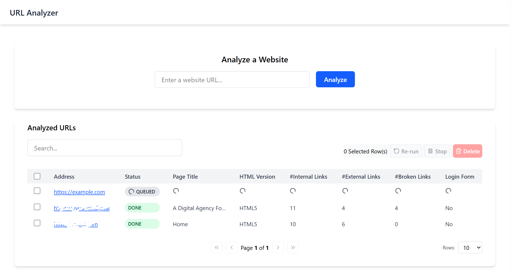
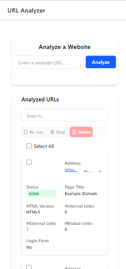
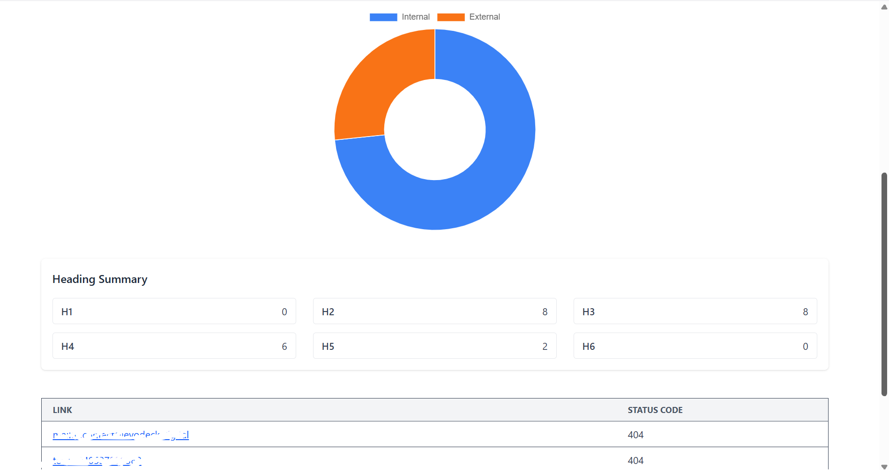

# 🌐 URL Analyzer

A fullstack web application to analyze URLs in real-time, extract metadata, evaluate link structures, detect broken links, and more.

- **Frontend:** Vite + React + TypeScript + Tailwind CSS + TanStack Query
- **Backend:** Go + Gin + GORM + MySQL
- **DevOps & Tooling:** Docker
- **Testing:** Vitest + React Testing Library

---

## ✨ Features

### Dashboard

- ✅ Submit a URL to analyze metadata (title, HTML version, login form)
- ✅ See internal/external/broken link counts
- ✅ Bulk actions: Re-run, Stop, Delete
- ✅ Status polling for real-time feedback (Queued, Running, Done)
- ✅ Paginated, searchable, and responsive (mobile/tablet-friendly) table

### Details Page

- ✅ View full metadata and crawl results
- ✅ Interactive donut chart (internal vs. external links)
- ✅ Heading summary (H1–H6 count)
- ✅ Table of broken links with status codes

---

## 📷 Screenshots

### Dashboard (Desktop)



### Dashboard (Mobile View)



### Details Page




---

## 🚀 Getting Started

### Clone the Repo

```bash
git clone https://github.com/dhiaHadjAmor/url-analyzer.git
cd url-analyzer
```

### Start via Docker

```bash
docker-compose up --build
```

- App: [http://localhost:5173](http://localhost:5173)
- API: [http://localhost:8080](http://localhost:8080)

### 🛠 Local Development (without Docker)

#### ✅ Prerequisites

- Node.js & npm
- Go 1.21+
- MySQL running locally

#### 🔧 Setup Frontend

```bash
cd client
npm install
npm run dev
```

#### 🔧 Setup Backend

```bash
cd server
go run main.go
```

Make sure to rename `/.env.example` to `/.env`:

---

## 🧪 Running Tests

```bash
cd client
npm run test
```

---

## 🛠️ Project Structure

```
url-analyzer/
├── client/               # Vite + React frontend
│   ├── src/
│   │   ├── pages/
│   │   │   ├── DashboardPage/
│   │   │   └── DetailsPage/
│   │   ├── components/   # Shared UI
│   │   |── lib/          # Types, utils, API layer
|   |   |── hooks/        # Custom hooks
│   └── tests/
├── server/               # Go backend
│   ├── models/
│   ├── routes/
│   ├── services/
│   └── crawler/          # Link extractor
├── docker-compose.yml
└── README.md
```

---

## 📦 DevOps & Tooling

| Tool           | Purpose                             |
| -------------- | ----------------------------------- |
| Docker Compose | Multi-container orchestration       |
| Vitest + RTL   | Unit & integration testing          |
| Tailwind CSS   | Utility-first responsive styling    |
| TanStack Query | Server state + polling              |
| GORM (MySQL)   | ORM for managing results & metadata |

---

## 📬 Author

Made with ❤️ by [Dhia Haj Amor](https://www.linkedin.com/in/dhiaha/)  
Feel free to connect or reach out!
